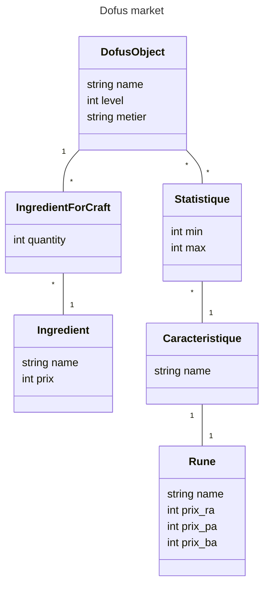

# dofus-market

```mermaid
---
title: Dofus market
---
classDiagram
    class DofusObject {
        string name
        int level
        string metier
    }

    class Ingredient {
        string name
        int prix
    }

    class IngredientForCraft {
        int quantity
    }

    class Statistique {
        int min
        int max
    }

    class Caracteristique {
        string name
    }

    class Rune {
        string name
        int prix_ra
        int prix_pa
        int prix_ba
    }

    DofusObject "1" -- "*" IngredientForCraft

    DofusObject "*" -- "*" Statistique

    IngredientForCraft "*" -- "1" Ingredient

    Caracteristique "1" -- "1" Rune

    Statistique "*" -- "1" Caracteristique

```