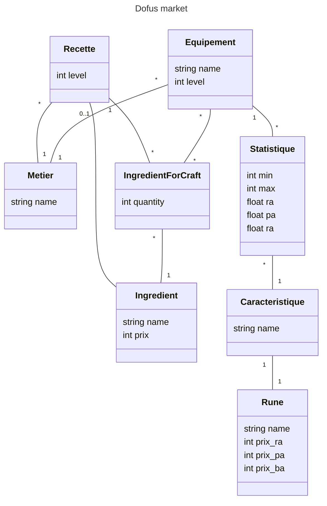

# dofus-market

## Dev

### Backend REST API + Database (Django)

Install dependencies

```shell
python -m venv .venv
source .venv/bin/activate
pip install -r requirements.txt
```

Migrate database and run dev server

```shell
cd dofus_market
python manage.py makemigrations market
python manage.py migrate
python manage.py runserver
```

Docker build

```shell
docker build -t chapellu/dofus-market-backend:alpha -f deploy/Dockerfile-backend .
```

Docker run

```shell
docker run -p 8000:8000 --name dofus-market-backend chapellu/dofus-market-backend:alpha
```

### Frontend (vuejs)

Install dependencies

```shell
cd dofus_market/frondend
npm install
```

Run dev server

```shell
npm run dev
```

Compiles and minifies for production

```shell
npm run build
```

#### Docker

Docker build

```shell
npm run build:docker
```

Docker run

```shell
npm run serve:docker
```

## Production




|name|level|metierForeignKey|
|----|---|---|
|Bottes du boufton|2|metier1|
**Table 1:** Equipement

|name|
|----|
|Cordonnier|
**Table 2:** Metier

|objetForeignKey|CaractéristiqueForeignKey|jetMin|jetMax|Ra|Pa|Ba|
|----|---|---|--|--|--|--|
|equipement1|caracteristique1|3|5|0.0|0.0|1.2|
**Table 3:** Statistique

|name|runeForeignKey|
|--|--|
|Agilité|rune1|
**Table 4:** Caracterisitque

|name|prixRa|prixPa|prixBa|
|--|--|--|--|
|Age|xx|xx|xx|
**Table 5:** Rune

|equipementForeignKey|ingredientForeignKey|quantity|
|--|--|--|
|equipement1|ingredient1|1|
|equipement1|ingredient2|1|
**Table 6:** IngredientForCraft

|name|price|
|--|--|
|Fleur de lin|12|
|bois de frenes|5|
**Table 7:** Ingredient
