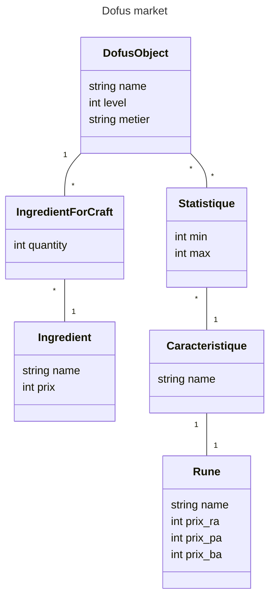
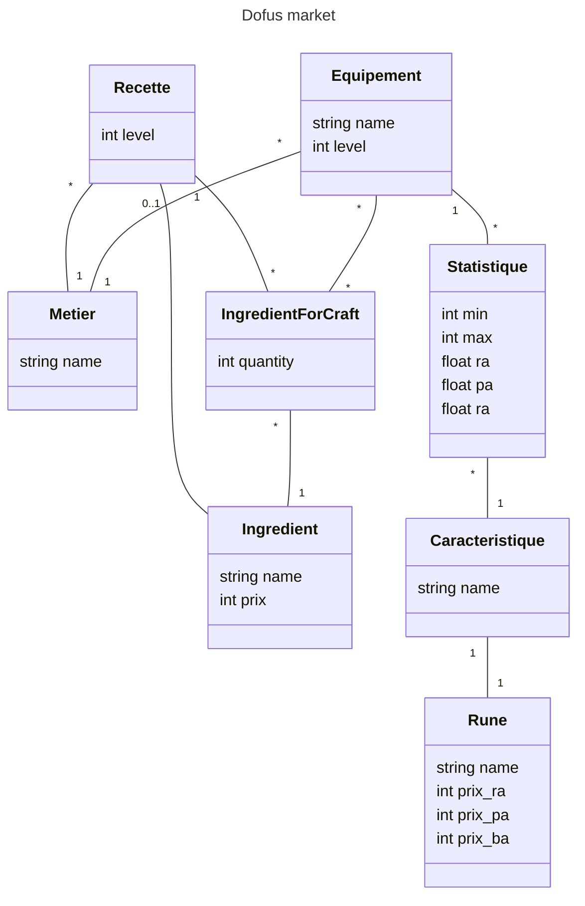

# dofus-market

---

|name|level|metierForeignKey|
|----|---|---|
|Bottes du boufton|2|metier1|
**Table 1:** Equipement

|name|
|----|
|Cordonnier|
**Table 2:** Metier

|objetForeignKey|CaractéristiqueForeignKey|jetMin|jetMax|Ra|Pa|Ba|
|----|---|---|--|--|--|--|
|equipement1|caracteristique1|3|5|0.0|0.0|1.2|
**Table 3:** Statistique

|name|runeForeignKey|
|--|--|
|Agilité|rune1|
**Table 4:** Caracterisitque

|name|prixRa|prixPa|prixBa|
|--|--|--|--|
|Age|xx|xx|xx|
**Table 5:** Rune

|equipementForeignKey|ingredientForeignKey|quantity|
|--|--|--|
|equipement1|ingredient1|1|
|equipement1|ingredient2|1|
**Table 6:** IngredientForCraft

|name|price|
|--|--|
|Fleur de lin|12|
|bois de frenes|5|
**Table 7:** Ingredient
