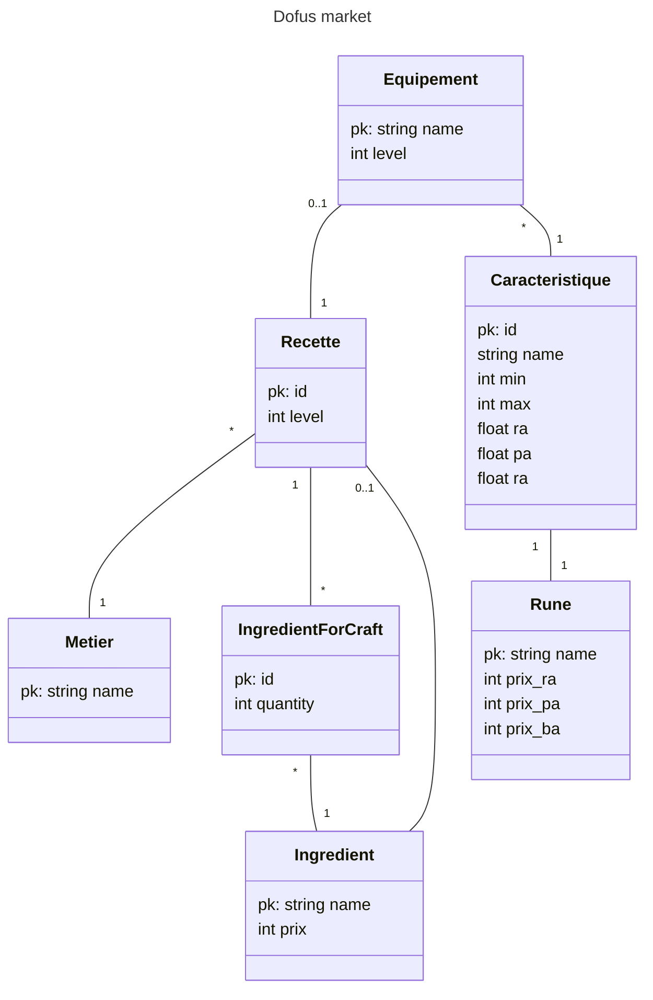

# Database schema

## UML

### Table example

| name (pk)         | level | metierForeignKey |
| ----------------- | ----- | ---------------- |
| Bottes du boufton | 2     | metier1          |
**Table 1:** Equipement

| name (pk)  |
| ---------- |
| Cordonnier |
**Table 2:** Metier

| id (pk) | name    | runeForeignKey | jetMin | jetMax | level | Ra  | Pa  | Ba  |
| ------- | ------- | -------------- | ------ | ------ | ----- | --- | --- | --- |
| 1       | Agilité | rune1          | 3      | 5      | 10    | 0.0 | 0.0 | 1.2 |
**Table 3:** Caracteristique

| name (pk) | prixRa | prixPa | prixBa |
| --------- | ------ | ------ | ------ |
| Age       | xx     | xx     | xx     |
**Table 4:** Rune

| id (pk) | ingredientForeignKey | quantity |
| ------- | -------------------- | -------- |
| 1       | ingredient1          | 10       |
| 2       | ingredient2          | 4        |
**Table 5:** IngredientForCraft

| name (pk)      | price |
| -------------- | ----- |
| Fleur de lin   | 12    |
| bois de frenes | 5     |
**Table 6:** Ingredient

| id (pk) | ingredientForeignKey | level | metierForeignKey |
| ------- | -------------------- | ----- | ---------------- |
| 1       | 2                    | 20    | 1                |
| 1       | 1                    | 10    | 1                |
**Table 7:** Recette
